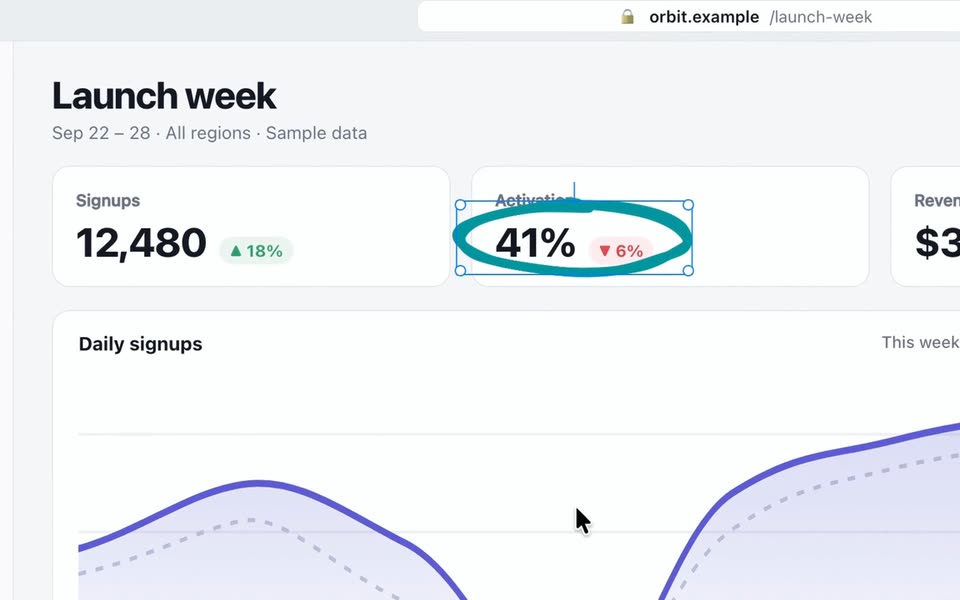
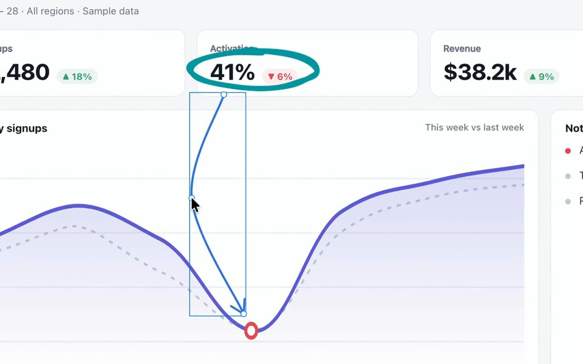
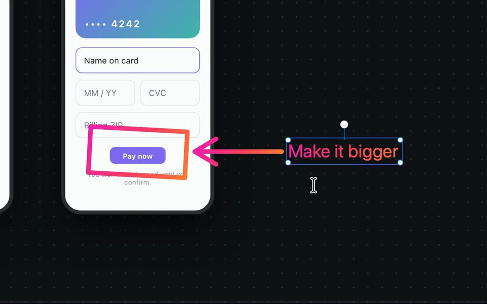
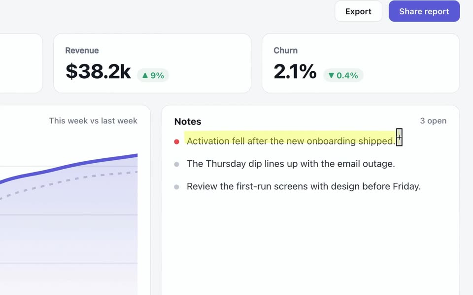
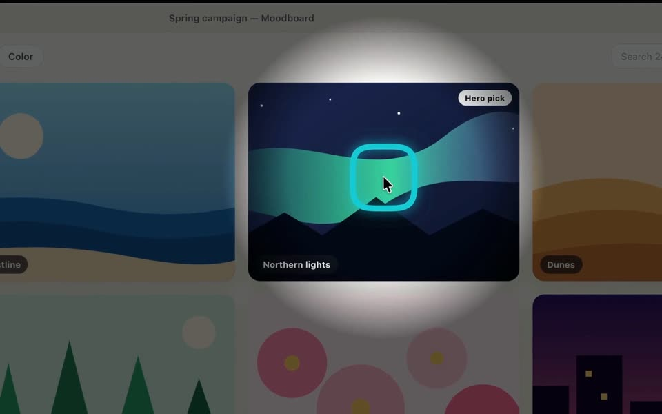
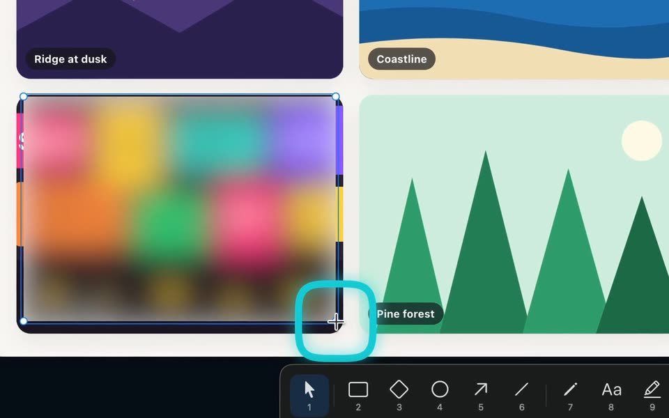

<div align="center">


# Annotator

**Draw on your screen as you explain.**<br>
Use it in demos, reviews and lessons. Every mark stays editable.

[**Download for Mac**](https://annotator-desktop.netlify.app/downloads/) &nbsp;·&nbsp;
[Website](https://annotator-desktop.netlify.app/) &nbsp;·&nbsp;
[Help](https://annotator-desktop.netlify.app/docs/) &nbsp;·&nbsp;
[Release notes](https://github.com/dorlugasigal/annotator/releases)

[](https://github.com/dorlugasigal/annotator/releases)
[](#install)
[](#install)
[](#about-this-repository)

</div>

https://github.com/user-attachments/assets/b87f25bf-7f11-4e36-8000-47584de43221

<p align="center"><sub>Recorded in the real Mac app, with a scripted pointer and made-up sample apps.<br>
Music: “Product Launch Advertising Commercial Music” by lNPLUSMUSIC, from Pixabay.</sub></p>

## What you can do

Pick a tool in the floating toolbar and draw over any app. Your marks stay on
screen while you keep working in the app underneath, and you can move, restyle
or undo them later.

<table>
<tr>
<td width="50%" valign="top">
<br>
<b>Circle</b><br>
Choose Ellipse and circle a number. The Sketchy style keeps it hand-drawn.
</td>
<td width="50%" valign="top">
<br>
<b>Arrow</b><br>
Click to place points and press Return. Drag a point to bend the arrow.
</td>
</tr>
<tr>
<td valign="top">
<br>
<b>Smart Draw</b><br>
Sketch a box or an arrow, and Smart Draw makes it neat. Then type a label.
</td>
<td valign="top">
<br>
<b>Highlight</b><br>
Drag the highlighter across a line of text.
</td>
</tr>
<tr>
<td valign="top">
<br>
<b>Spotlight</b><br>
Turn on the cursor halo and Spotlight. The light follows your pointer.
</td>
<td valign="top">
<br>
<b>Blur</b><br>
Drag over a busy picture to blur it. Blur isn't secure redaction.
</td>
</tr>
</table>

Annotator has more than 40 tools. Open the tool library with <kbd>⌘L</kbd> or its
toolbar button for shapes, diagram icons, Screen zoom, Pointer lens, Pixelate,
a numbered counter, a pixel ruler, pasted images and your own saved shapes.
Style any mark with fills, gradients, dashed or sketchy lines, or draw on a
whiteboard or blackboard. [Watch each tool on the website.](https://annotator-desktop.netlify.app/#workspace)

An AI assistant with computer-use tools can also drive Annotator through its
normal interface. [Set up the Annotator skill.](https://annotator-desktop.netlify.app/ai/)

## Install

Annotator needs macOS 14 or later and a Mac with an Apple M-series chip. It is
a public alpha, so read the known limits in the
[release notes](https://github.com/dorlugasigal/annotator/releases) first.

### Disk image

1. [Download Annotator](https://annotator-desktop.netlify.app/downloads/) and open the disk image.
2. Drag Annotator into Applications.
3. Open Annotator from Applications. It runs from the menu bar, not the Dock.

Annotator can update itself only from the Applications folder. If you open it
from anywhere else, it offers to show it in Finder so you can move it.

### Homebrew

```sh
brew tap dorlugasigal/annotator https://github.com/dorlugasigal/annotator
brew install --cask dorlugasigal/annotator/annotator
```

To update, save your boards and quit Annotator, then run:

```sh
brew update
brew upgrade --cask dorlugasigal/annotator/annotator
```

If macOS blocks Annotator, [report the exact message](https://github.com/dorlugasigal/annotator/issues/new?template=bug-report.yml).
Don't remove the quarantine attribute or turn off security checks.

## Get started

| To | Press |
| --- | --- |
| Draw on the screen | <kbd>⌃⇧2</kbd> (Control-Shift-2) |
| Use the app underneath, with your drawings still on screen | <kbd>Esc</kbd> |
| Show or hide your drawings and the toolbar | <kbd>⌃2</kbd> (Control-2) |
| Open the tool library while drawing | <kbd>⌘L</kbd> |

These are the default keys. Change them in Settings > Shortcuts. Esc first
finishes the text or shape you are drawing. Settings and Help are in
Annotator's menu-bar menu.

## Privacy and screen sharing

- Annotator has no account. Your drawings, screen pixels and keystrokes stay on your Mac.
- Drawing needs no permissions. Screen zoom and live effects need Screen Recording, but Annotator doesn't record or save video. Option-scroll zoom over other apps needs Accessibility.
- Usage counts are off unless you turn them on. Even then, they never include drawings, screenshots or text.
- If you share your whole screen, others see your drawings. App or window sharing may leave them out, so ask someone on the call what they see.
- Blur, Pixelate and Distort can leave details readable. Hiding or quitting Annotator removes covers.
- Saved boards keep pasted images whole, even the parts under covers. Don't share a board with private details.
- An AI app that controls Annotator may send screenshots and text to its provider. Check that app's privacy settings.

[Privacy](https://annotator-desktop.netlify.app/privacy/) ·
[Screen-sharing and capture limits](https://annotator-desktop.netlify.app/docs/#limitations)

## Feedback and support

- [Report a problem](https://github.com/dorlugasigal/annotator/issues/new?template=bug-report.yml) or [share feedback](https://github.com/dorlugasigal/annotator/issues/new?template=feedback.yml). Issues are public, so use made-up data and never attach credentials or private screenshots.
- Say which version and build you use, your macOS version and the steps. In Annotator, Settings > About > Copy support info gathers app and system details without drawings or screenshots.
- Report security problems privately. See [SECURITY.md](SECURITY.md).
- If Annotator helps you, you can [buy me a coffee](https://buymeacoffee.com/dorlugasigal). All tools stay free either way.

## About this repository

Annotator is proprietary and free to use. Its source code is private. This
repository holds the app releases and their notes, the Homebrew cask, the issue
forms and the redirect from the old GitHub Pages address to the
[current website](https://annotator-desktop.netlify.app/).
